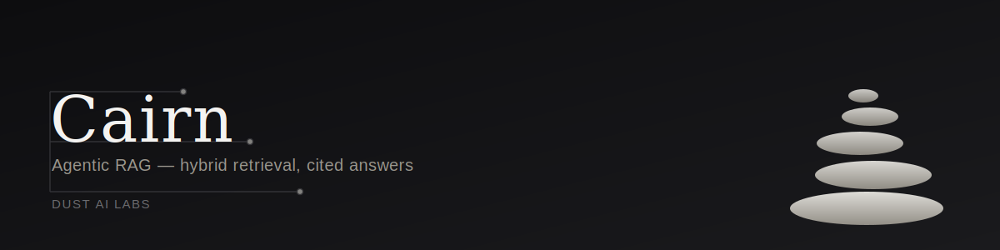

# Cairn

[](https://github.com/dustailabs/Cairn/actions/workflows/ci.yml)
[](LICENSE)
[](https://www.python.org/)
[](https://github.com/crewAIInc/crewAI)
[](https://fastapi.tiangolo.com/)

**Agentic RAG with hybrid retrieval and an answer you can actually audit.**

Cairn ingests a document set, retrieves with **BM25 (keyword) + vector
search fused by Reciprocal Rank Fusion**, then hands the retrieved
passages to a three-agent **CrewAI** crew — Planner, Researcher, Critic —
that decomposes the question, gathers grounded passages, and writes a
final answer where **every claim cites a real chunk id**. Citations that
don't match anything actually retrieved are dropped and logged, not
silently passed through.

Built by [Dust AI Labs](https://github.com/dustailabs) as a reference
implementation: the same pattern (hybrid retrieval + a citation-checked
agent crew) generalizes to internal knowledge bases, support docs, and
compliance/legal corpora well beyond the demo here.

---

## How it works

```
                 ┌────────────────────┐
  Document(s) →  │   DocumentStore    │  chunk + store
                 └────────────────────┘
                            │
                            ▼
                 ┌────────────────────┐
                 │  HybridRetriever   │  BM25  ⊕  Vector (RRF fusion)
                 └────────────────────┘
                            │  top-k chunks, ranked + chunk-id tagged
                            ▼
        ┌─────────┐    ┌────────────┐    ┌─────────┐
        │ Planner │ →  │ Researcher │ →  │ Critic  │
        └─────────┘    └────────────┘    └─────────┘
        sub-questions   retrieval tool     cites chunk ids
                         calls (traced)     per claim
                            │
                            ▼
                 ┌────────────────────┐
                 │ Citation validator │  drops any chunk id
                 └────────────────────┘  never actually retrieved
                            │
                            ▼
              Answer + citations + full trace
```

Retrieval combines two ranked lists by **rank position** (RRF), not raw
score — BM25 scores and cosine similarities live on incompatible scales,
so fusing by rank avoids one leg silently dominating the other. Every
retrieval call, every crew step, and the validation pass emits a
`TraceEvent`, the same way Concord traces its agent handoffs — that trace
is what the API returns alongside the answer.

## Project structure

```
cairn/
  retrieval/   — BM25Index, VectorIndex, HybridRetriever (RRF), DocumentStore, chunking
  crew/        — Planner/Researcher/Critic agents + tasks (CrewAI), retrieval tool,
                 output parsing & citation validation (framework-free, independently tested)
  api/         — FastAPI app: /ingest, /query, /health
  trace.py     — TraceEvent + Tracer used across retrieval and the crew
tests/         — pytest, fully offline (HashingEmbedder, no network/API key required)
demo.py        — CLI demo: retrieval-only without an API key, full crew with one
```

## Running it locally

```bash
pip install -e .
python demo.py "How does Cairn fuse keyword and vector search?"
```

Without `ANTHROPIC_API_KEY` set, the demo prints a retrieval-only preview
(fused BM25 + vector ranks) so you can see hybrid retrieval working
without spending a token. Set the key to run the full Planner → Researcher
→ Critic crew and get a cited answer:

```bash
export ANTHROPIC_API_KEY=sk-ant-...
python demo.py "How does Cairn fuse keyword and vector search?"
```

To run the API:

```bash
uvicorn cairn.api.main:app --reload
```

```bash
curl -X POST localhost:8000/ingest -H 'content-type: application/json' \
  -d '{"text": "Kafka brokers replicate partitions across the cluster.", "source": "kafka-doc"}'

curl -X POST localhost:8000/query -H 'content-type: application/json' \
  -d '{"query": "How does Kafka replicate partitions?"}'
```

## Testing

```bash
pip install -e ".[dev]"
pytest
```

Tests run fully offline. The retrieval layer is tested directly with a
deterministic `HashingEmbedder` (no model download, no network). The
crew's output parsing and citation validation — the part that decides
whether a claim is trustworthy — are framework-free pure functions in
`cairn/crew/parsing.py`, tested independently of any actual `crewai`
agent call. One integration test wires the real `crewai` Agent/Task
objects with a stub LLM to confirm the role/tool/context chain is correct,
and is skipped automatically if `crewai` isn't installed.

## Extending Cairn

- **Real semantic embeddings**: swap `HashingEmbedder()` for
  `SentenceTransformerEmbedder()` in `cairn/api/main.py` (`pip install
  'cairn[semantic]'`) — same interface, no other code changes.
- **A bigger corpus / ANN search**: replace `VectorIndex`'s brute-force
  cosine search with FAISS, pgvector, or Qdrant behind the same
  `search()` signature.
- **A new agent role**: see [`CONTRIBUTING.md`](CONTRIBUTING.md).
- **A different LLM provider**: `cairn/crew/llm.py` is the only place
  the provider is named — point `crewai.LLM` at any LiteLLM-supported
  model.

## License

MIT — see [LICENSE](LICENSE).

---

## About Dust AI Labs

Dust AI Labs is an AI engineering consultancy. We architect, build, and ship
production GenAI systems — agentic pipelines, retrieval-augmented knowledge
platforms, and LLM-driven automation — for FinTech, Healthcare, E-Commerce,
LegalTech, and Enterprise SaaS clients. Every engagement is built end-to-end
by a single senior practitioner: no offshoring, no junior pass-through.

Cairn is one of several open-source reference builds — see the [full profile, case studies, and engagement models →](https://github.com/dustailabs)

**Get in touch:** <dustailabs@proton.me> · [book a discovery call](https://calendly.com/dustailabs-proton)
